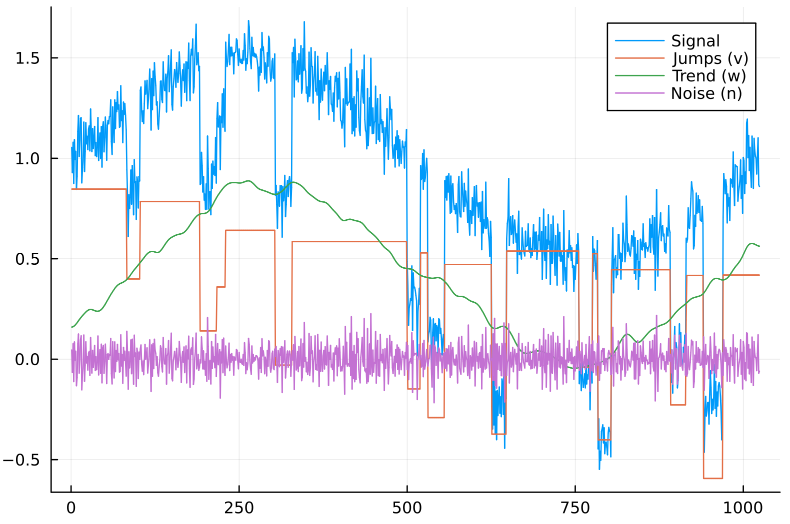

# JOT-Bridge
This projects consists of a Julia implementation of JOT [[1]](#1), and algorithm to decompose a signal into jump, trend and oscillation, to the identification of sudden changes in the input forces of a system with the measurements in the system response.
We have two goals with this project.
First, since a big part of JOT is iteratively solving linear equations, we want to provide a fast implementation of JOT that leverages the structure of the systems to produce fast solutions.
Second, be able to accurately identify "jumps" on the input force `f` of a system `AₙDⁿ(u) + ... + A₁D(u) + A₀u=f` (`D` denotes spatial derivative) only with knowledge of measurements at certain points of `y`.
## Usage
```julia
using CSV

include("src/jot/stage1.jl")
using .Stage1

f = CSV.File(open("data/example.csv"), header=false).Column1
params = Dict("γ1" => 0.05, "γ2" => 1000.0, "γ3" => 0.05, "β" => 12.5, "a" => 50.0, "κ" => 1e-7)

dh = DataHolder(f, params);
sl = ADMMSolver(length(f), dh, 1_500);
@time solve_stage1!(sl)
visualize(sl)
```
## Example


## References
<a id="1">[1]</a> 
Martin Huska, Antonio Cicone, Sung Ha Kang and Serena Morigi (2023). 
A Two-stage Signal Decomposition into Jump, Oscillation and Trend using ADMM
